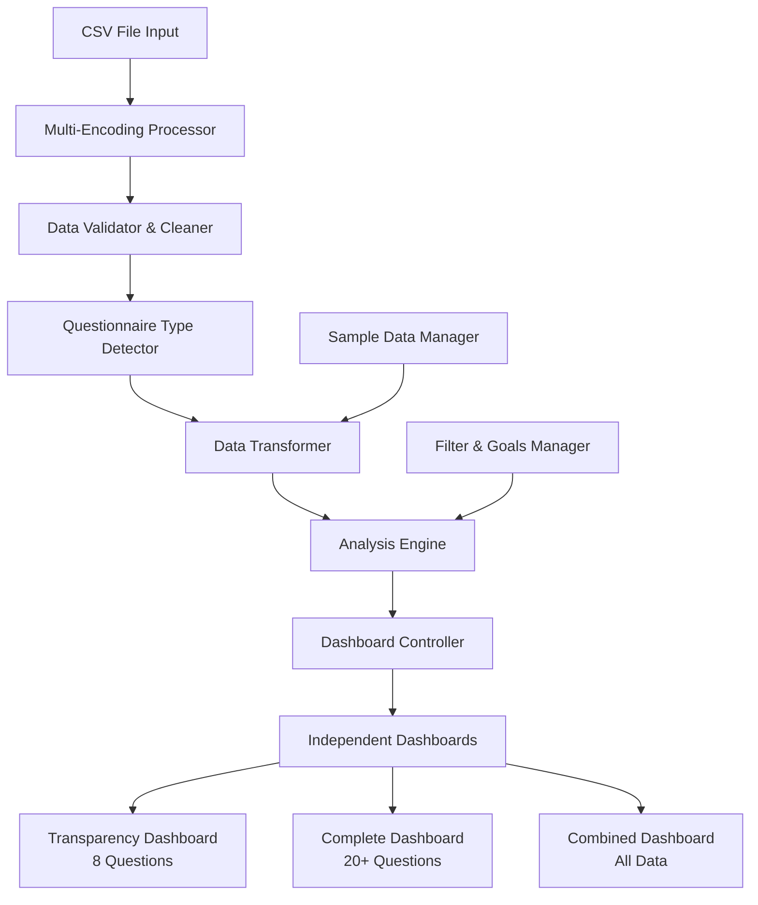
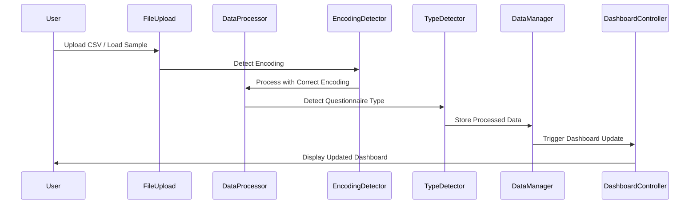

# Design Document

## Overview

Esta solução redesenha o sistema de processamento de dados e dashboards do PSDigQual para resolver problemas críticos de encoding, carregamento de dados e visualização. O design foca em robustez, detecção automática inteligente e dashboards independentes para diferentes tipos de questionários.

## Architecture

### High-Level Architecture



### Data Flow Architecture



## Components and Interfaces

### 1. Enhanced Data Processor (`dataProcessor.js`)

**Responsibilities:**
- Multi-encoding detection and processing
- Robust CSV parsing with error handling
- Data validation and cleaning
- Questionnaire type detection

**Key Methods:**
```javascript
// Enhanced encoding detection
async function processFileWithMultipleEncodings(file)
async function detectAndProcessEncoding(text, encodings)

// Improved CSV processing
function processCSVDataRobust(csvText, options)
function validateAndCleanData(rawData)

// Enhanced type detection
function detectQuestionnaireTypeAdvanced(headers, data)
function analyzeQuestionPatterns(headers)
```

**Encoding Detection Strategy:**
1. Try UTF-8 first (most common)
2. Try ISO-8859-1 (Latin-1) for Portuguese characters
3. Try Windows-1252 for legacy files
4. Apply character replacement patterns for common corruptions

### 2. Questionnaire Type Detector

**Detection Criteria:**
```javascript
const DETECTION_RULES = {
  transparency: {
    maxQuestions: 12,
    specificQuestions: [
      'Portal é fácil de usar',
      'fácil localizar dados',
      'navegação intuitiva',
      'Portal funciona sem falhas'
    ],
    questionCodes: ['QS1', 'QS3', 'QS8', 'QS9', 'QI1', 'QI2', 'QI7', 'QO4']
  },
  complete: {
    minQuestions: 15,
    dimensions: ['QS', 'QI', 'QO'],
    specificQuestions: [
      'recursos de acessibilidade',
      'políticas de privacidade',
      'suporte técnico'
    ]
  }
}
```

### 3. Enhanced Data Manager (`useData.js`)

**State Management:**
```javascript
const [data, setData] = useState({
  transparency: { data: [], type: 'transparency', metadata: {} },
  complete: { data: [], type: 'complete', metadata: {} },
  combined: { data: [], type: 'combined', metadata: {} },
  active: 'combined' // Which dataset is currently active
});

const [processingStatus, setProcessingStatus] = useState({
  isLoading: false,
  lastProcessed: null,
  errors: [],
  warnings: [],
  statistics: {}
});
```

**Key Functions:**
```javascript
// Enhanced data loading with complete cleanup
async function loadDataWithCleanup(processedData)
function resetAllData()
function switchActiveDataset(type)

// Improved filtering and analysis
function applyFiltersToDataset(dataset, filters)
function calculateAnalysisForDataset(dataset, goals)
```

### 4. Dashboard Controller

**Responsibilities:**
- Route data to appropriate dashboard components
- Manage dashboard state and updates
- Handle dashboard switching logic

**Dashboard Types:**
```javascript
const DASHBOARD_CONFIGS = {
  transparency: {
    questions: 8,
    dimensions: ['QS', 'QI', 'QO'],
    specificQuestions: TRANSPARENCY_CODES,
    title: 'Portal da Transparência',
    color: 'blue'
  },
  complete: {
    questions: 20,
    dimensions: ['QS', 'QI', 'QO'],
    allQuestions: true,
    title: 'Questionário Completo',
    color: 'purple'
  },
  combined: {
    adaptive: true,
    title: 'Visão Combinada',
    color: 'green'
  }
}
```

### 5. Independent Dashboard Components

**Transparency Dashboard:**
- Focused on 8 core questions
- Simplified KPIs relevant to transparency
- Specific recommendations for public portals

**Complete Dashboard:**
- Full 20+ question analysis
- All three dimensions (QS, QI, QO)
- Comprehensive service quality metrics

**Combined Dashboard:**
- Adaptive layout based on available data
- Comparative analysis when both types present
- Unified view with type indicators

## Data Models

### Enhanced Data Structure

```javascript
// Processed Data Model
interface ProcessedData {
  data: Array<ResponseRecord>;
  type: 'transparency' | 'complete' | 'combined';
  metadata: {
    originalFileName?: string;
    encoding: string;
    processedAt: Date;
    totalRecords: number;
    validRecords: number;
    invalidRecords: number;
    questionCodes: string[];
    profileFields: string[];
    validationSummary: ValidationSummary;
  };
}

// Response Record Model
interface ResponseRecord {
  // Question responses (QS1, QS2, etc.)
  [questionCode: string]: number | null;
  
  // Profile data with standardized keys
  __profile__sexo?: string;
  __profile__idade?: string;
  __profile__escolaridade?: string;
  __profile__servidor?: string;
  
  // Original profile fields preserved
  [originalProfileField: string]: any;
}

// Validation Summary
interface ValidationSummary {
  totalLines: number;
  validLines: number;
  invalidLines: number;
  questionColumns: number;
  headerColumns: number;
  encodingIssues: number;
  cleanupActions: string[];
}
```

### Analysis Data Model

```javascript
interface AnalysisResult {
  questionAverages: Record<string, QuestionAnalysis>;
  dimensionAverages: Record<string, number>;
  classification: {
    critical: QuestionItem[];
    neutral: QuestionItem[];
    positive: QuestionItem[];
  };
  profileData: ProfileAnalysis;
  recommendations: Recommendation[];
  totalResponses: number;
  datasetInfo: {
    type: string;
    hasTransparency: boolean;
    hasComplete: boolean;
    activeFilters: any;
  };
}
```

## Error Handling

### Encoding Error Recovery

```javascript
const ENCODING_RECOVERY_STRATEGIES = {
  // Common Portuguese character corruptions
  characterReplacements: {
    'á': 'á', 'é': 'é', 'í': 'í', 'ó': 'ó', 'ú': 'ú',
    'ç': 'ç', 'à ': 'à', 'â': 'â', 'ã': 'ã', 'ê': 'ê',
    'ô': 'ô', 'è': 'è', '�': ''
  },
  
  // Fallback strategies
  fallbackEncodings: ['UTF-8', 'ISO-8859-1', 'Windows-1252'],
  
  // Recovery actions
  recoveryActions: [
    'tryAlternativeEncoding',
    'applyCharacterReplacements',
    'removeInvalidCharacters',
    'usePartialData'
  ]
};
```

### Data Validation Error Handling

```javascript
const VALIDATION_RULES = {
  minimumResponseRate: 0.3, // 30% of questions must be answered
  requiredQuestions: 1, // At least 1 valid Likert response
  maxInvalidRows: 0.5, // Allow up to 50% invalid rows
  
  errorActions: {
    lowResponseRate: 'exclude_row',
    noValidQuestions: 'exclude_row',
    tooManyInvalidRows: 'warn_user',
    encodingIssues: 'attempt_recovery'
  }
};
```

## Testing Strategy

### Unit Tests

1. **Encoding Detection Tests**
   - Test UTF-8, ISO-8859-1, Windows-1252 files
   - Test character corruption recovery
   - Test fallback mechanisms

2. **Data Processing Tests**
   - Test CSV parsing with various formats
   - Test data validation and cleaning
   - Test questionnaire type detection

3. **Analysis Engine Tests**
   - Test calculation accuracy
   - Test classification logic
   - Test profile data extraction

### Integration Tests

1. **End-to-End Data Flow**
   - Upload → Process → Analyze → Display
   - Test with real sample files
   - Test error scenarios

2. **Dashboard Integration**
   - Test dashboard switching
   - Test data updates
   - Test filter applications

### Performance Tests

1. **Large File Processing**
   - Test with files up to 10MB
   - Test with 1000+ responses
   - Memory usage monitoring

2. **Real-time Updates**
   - Dashboard update speed
   - Filter application speed
   - Chart rendering performance

## Implementation Phases

### Phase 1: Core Data Processing
- Enhanced encoding detection
- Robust CSV processing
- Improved data validation
- Better error handling

### Phase 2: Dashboard Independence
- Separate dashboard logic
- Type-specific components
- Enhanced data routing
- Improved state management

### Phase 3: User Experience
- Better loading indicators
- Detailed error messages
- Processing statistics
- Enhanced feedback

### Phase 4: Optimization
- Performance improvements
- Memory optimization
- Caching strategies
- Advanced analytics